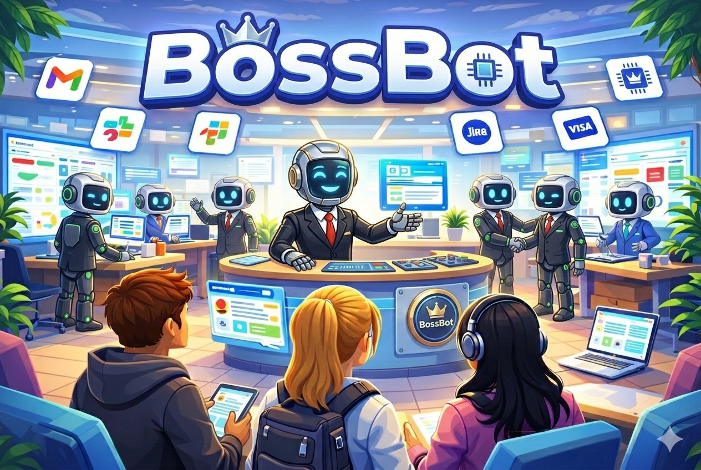
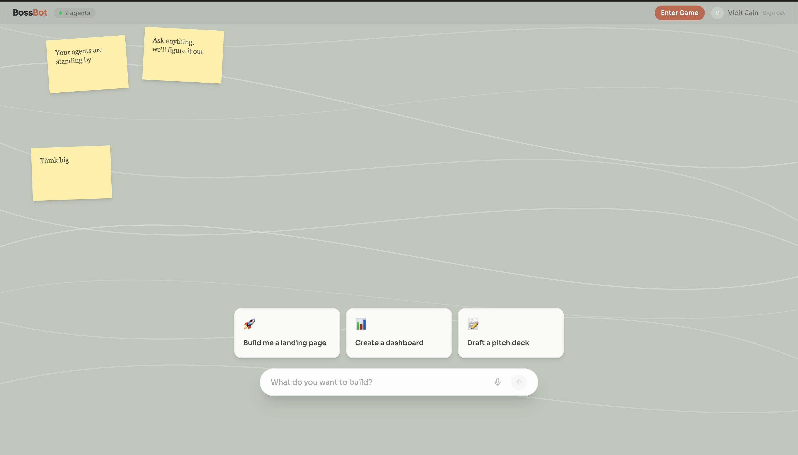
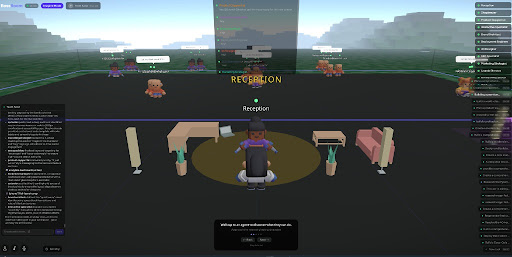

# BossBot

<p align="center">
  
</p>

**BossBot** is a virtual office where AI agents are your coworkers, available in both immersive 3D (inspired by **Minecraft**) and streamlined 2D (like **Claude Imagine**!). Navigate a physics-enabled workspace or use a desktop-style interface, speaking by voice or text while agents execute real tasks: sending emails in Gmail, scheduling meetings on Google Calendar, filing tickets in Linear, and researching the web using Browser Use! 

A Receptionist agent dynamically assembles teams of 3–12 specialists on demand. Built with Next.js, React Three Fiber, and Tailwind on the frontend; Node.js, WebSockets, and the Vercel AI SDK on the backend; deployed on GCP Cloud Run and Cloudflare Pages. 

Built in 20 hours at **YC’s Browser Use Web Agents Hackathon**!


---

## Inspiration

Using AI agents today feels like using a computer before GUIs existed. You type prompts into chat boxes, configure API keys, manage tools through dashboards. It's powerful — but it's the command line era of AI. It locks out most people and strips away any sense of collaboration or fun.

We asked: **what if we built the graphical interface for AI agents?** Not another chat wrapper. Not another dashboard. A living 3D world where you walk up to an AI character — the way you'd walk up to a coworker — and just tell it what you need. It figures out the team, assigns the work, and you watch it happen.

We drew inspiration from Astro Bot's CPU Plaza (spatial exploration as discovery), Papa's Pizzeria (microinteractions that make mundane tasks feel alive), and GTA's onboarding (progressive disclosure through gameplay). We wanted that same feeling — but for getting real work done with AI.

The result is something we honestly didn't think was possible in 36 hours: a full game engine, a multi-agent AI orchestration system, real-time voice pipelines, a commerce platform, multiplayer networking, and production cloud infrastructure — all working together.

## What it does

<p align="center">
  
</p>

BossBot is a **multiplayer 3D virtual office** where AI agents are your coworkers. You navigate a third-person character through a physics-enabled world, walk up to agents at their desks, and delegate real tasks — by typing or by holding a push-to-talk key and speaking naturally.

**These agents don't just chat. They execute.** They send actual emails through Gmail, create real tickets in Linear, book real meetings on Google Calendar, search real products across retailers, and process real payments through Visa.

### The Receptionist: Dynamic Team Assembly

The Receptionist is your office concierge. Describe any task — "research my company's competitors and write a report" — and it **dynamically creates an entire team of specialized AI agents on the fly**. A Research Lead, a Deep Researcher, a Report Writer, a Fact Checker — each with a unique name, personality, color, skill set, and zone in the office. The lead agent immediately starts delegating subtasks to workers. All agents post updates to a shared scratchpad feed. The entire team is persisted to a PostgreSQL database and survives server restarts.

We didn't hardcode agents. The LLM decides how many agents to create (3-12), what skills they need, and who leads. Every workspace is different.

### The Shopkeeper: In-Game Commerce

Walk up to the Shopkeeper and say "find me wireless headphones under $50." It searches real products via Visa Intelligent Commerce MCP, renders interactive product cards with real images, prices, and ratings — and you can click Buy to process a payment through Visa, all without leaving the 3D world.

### Voice — Both Ways, Spatialized in 3D

Talk to agents using push-to-talk — your voice is transcribed in real-time by Deepgram Nova-3 via streaming WebSocket. Agents respond with synthesized voice (Inworld TTS) played through **HRTF spatial audio** — their voice gets louder as you walk closer and pans left/right based on their 3D position. Players can also voice chat with each other using **proximity-based P2P spatial audio** over WebRTC — hold T near another player and their voice fades in with distance, just like real life. Two completely independent spatial audio pipelines sharing a single AudioContext.

### The World

<p align="center">
  
</p>

The office sits on **procedurally generated terrain** using simplex noise with Minecraft-style quantized heights, vertex-colored grass and earth, flowers and decorations — chunk-loaded around the player with LOD falloff. Walk far enough past the office walls and you'll discover a hidden Stanford campus model surrounding the building. 13 selectable avatar models with live 3D previews. A Roblox-style third-person camera with right-click orbit and scroll zoom. Background music with a track selector. A GTA-style onboarding tutorial. Bloom and vignette post-processing. It's a game.

## How we built it

Five systems that each would be a full hackathon project on their own — a real-time 3D game engine, a self-assembling agent swarm, dual spatial voice pipelines, an in-world commerce platform, and production cloud infra — all multiplexed over a **single persistent WebSocket** connection. Here's exactly how.

### The Agent Swarm (Core Architecture)

This is the thing that makes BossBot different from every other multi-agent demo you've seen.

Most "multi-agent" systems are hardcoded graphs. You define the agents, define the edges, run the graph. BossBot doesn't work that way. When you describe a task, the **Receptionist LLM calls a `setup_workspace` tool mid-stream**. That tool call carries a JSON payload with 3–12 agent definitions the model invented on the spot: names, personalities, hex colors, zone coordinates, system prompts, skill lists, and a delegation graph. The server parses it, runs a bulk insert into PostgreSQL via Drizzle ORM, registers each agent in memory, and broadcasts a `workspace:build` event to every connected client — all before the Receptionist finishes its response stream. The frontend receives the event and animates each agent materializing at their desk in the 3D world in sequence.

The lead agent immediately begins streaming its first delegation. Workers receive `delegate_task` calls, spin up their own `streamText` sessions with `stopWhen: stepCountIs(25)` multi-step tool calling, and post results to a **Supermemory**-backed scratchpad that persists across sessions — so when you return to a workspace tomorrow, every agent remembers exactly where the work left off. The lead collects all worker outputs via `finish_task` and the Receptionist synthesizes a final summary. The entire swarm spawned from one sentence.

**Vercel AI Gateway** sits in front of every LLM call — a single `createOpenAI`-compatible endpoint that proxies to Gemini 3 Flash, Claude Sonnet, or GPT-4o via BYOK keys in the Vercel dashboard. One `AI_GATEWAY_API_KEY`, zero hardcoded provider credentials, and the ability to route different agents to different models in a single config change. The Vercel AI SDK's `streamText` handles multi-step tool calling with automatic continuation — agents chain tool calls without any manual loop logic.

### Real-World Tool Execution via Composio + Browser Use

Agents don't simulate work. They do it.

**Composio** gives every agent access to OAuth-scoped tool sets, keyed per-user by Firebase UID. When the Email Agent sends a Gmail message, it's using *your* Gmail OAuth token — not a service account. When the Scheduler books a meeting, it creates a real event in *your* Calendar. Composio manages the OAuth handshake, token refresh, and scope isolation. We call `composio.getTools({ apps: ['GMAIL', 'GOOGLECALENDAR', 'LINEAR'] })` and pass the resulting tool definitions directly into the AI SDK — the LLM sees them as native tools.

For research tasks, agents invoke **Browser Use** — a headless browser automation layer that lets agents navigate real websites, extract live information, and return structured results. An agent can be told "research our top 5 competitors' pricing pages" and Browser Use handles the actual browsing: loading pages, scrolling, extracting tables, handling JS-rendered content. This isn't SerpAPI keyword matching. It's a real browser doing real research.

### Spatial Voice — Two Pipelines, One AudioContext

**Pipeline 1 (Agent STT/TTS):** The client opens a WebSocket directly to `wss://api.deepgram.com/v1/listen` with model `nova-3`, streaming raw PCM mic audio in real-time. Deepgram returns transcripts as JSON deltas over the same socket — we forward the final transcript as an `agent:message` to our game server. On the response path, the server calls **MiniMax TTS** (`speech-2.8-hd` model via REST POST to `https://api.minimax.io/v1/t2a_v2`) which returns hex-encoded MP3 audio. We convert it to base64 and send it as an `agent:ttsAudio` WebSocket message. The client decodes the base64 into an `AudioBuffer`, creates a `BufferSourceNode`, routes it through an `HRTF PannerNode` set to the agent's exact Three.js world coordinates, and plays it. The voice comes *from* the agent's position in 3D space.

**Pipeline 2 (Player proximity voice):** PeerJS establishes WebRTC `RTCPeerConnection` between nearby players using Firebase UIDs as peer IDs. Each remote player's `MediaStream` gets routed through its own `HRTF PannerNode` updated every render frame from that player's live position in the world. Voice rolls off with distance using an inverse model — walk closer and it gets louder, walk away and it fades. Both pipelines share a **single `AudioContext` singleton** to avoid the browser's limit on concurrent audio contexts.

### In-World Commerce via Visa Intelligent Commerce MCP

The Shopkeeper agent runs an **MCP (Model Context Protocol) client** connected to Visa's Intelligent Commerce server. MCP is the open standard for wiring external tool servers to LLMs — instead of wrapping an API in a Composio adapter, we speak the MCP wire protocol directly using `@ai-sdk/mcp`. The Visa VIC MCP server exposes tools for product search, price comparison, and payment processing. We call `mcpClient.tools()` and inject them into the agent's tool set alongside its Composio tools.

When you ask for "wireless headphones under $50," the Shopkeeper calls the VIC search tool, gets back real product data (names, prices, images, ratings, retailers), and invokes our custom `display_products` tool — which sends a typed `agent:productCards` WebSocket message to the frontend, which renders interactive cards in the chat panel. Click Buy: the agent calls the VIC purchase tool, Visa processes the payment, and the result comes back as `shop:purchaseResult`. Shopping in a game world, powered by real rails.

### 3D Game Engine

React Three Fiber + drei + Rapier physics inside Next.js 16 / React 19 / Tailwind v4. Physics-based character controller (ecctrl) with a Roblox-style third-person camera — right-click to orbit, scroll to zoom, V to toggle first-person. Procedurally generated chunked terrain via simplex noise: quantized Minecraft-style heights, vertex-colored grass/earth, LOD falloff (full resolution near chunks, 8-cell far chunks), scattered flowers and decorations. 13 Kenney.nl character models with idle/walk/sprint/jump animations. Agent visual states (idle → listening → thinking → working → done → error) driven by 14 Zustand stores, synchronized from server events. HTML `<Billboard>` speech bubbles anchored in 3D space above agents. Bloom + vignette post-processing on status orbs and neon desk strips. 46 WebSocket message types, fully typed end-to-end with Zod on both sides.

### Production Infrastructure

Terraform provisions the entire stack. `terraform apply` from zero to production in one command:

- **GCP Cloud Run** — WebSocket server, HTTP/1.1, 3600s session timeout, TCP keepalive, Cloud SQL proxy as sidecar via volume mount
- **Cloud SQL PostgreSQL 15** — 7 tables (users, workspaces, workspace_agents, skills, conversations, task_history, scratchpad_entries) via Drizzle ORM with typed schema
- **Cloudflare Pages** — Static-exported Next.js, `NEXT_PUBLIC_*` vars baked at build time, Terraform-managed (not the dashboard)
- **Firebase Auth** — Google Sign-In, Admin SDK token verification on every WebSocket handshake, per-user scoped Composio entity keys
- **Cloud Build** — `gcloud builds submit` → amd64 Docker image → Artifact Registry → Cloud Run force-deploy (ARM-safe)

One `terraform apply`. No clicking through dashboards at 3am.

## Challenges we ran into

**The unholy trinity of game dev + agentic AI + real-time voice.** Any one of these is a significant project. We built all three and wired them together over WebSocket in 36 hours.

Getting the **3D interaction loop** to feel right was brutal — tuning click detection, camera angles, and chat panel overlays to not fight with physics-based 3D controls took dozens of iterations. The camera system alone went through three rewrites.

**WebSocket state synchronization** between the game server and multiple clients required careful architecture. 46 message types, typed with Zod, validated on both ends. Agent status changes, workspace snapshots, scratchpad entries, product cards, voice state, player positions — all flowing through a single multiplexed connection with 30-second keepalive pings to survive Cloud Run's idle timeout.

**Dynamic agent creation** was architecturally wild. The Receptionist LLM calls a tool that creates 3-12 new agents, each with system prompts, skills, positions, colors — persists them all to PostgreSQL, registers them in memory, broadcasts workspace:build to the frontend which animates them materializing in the 3D world, and the lead agent immediately starts streaming its first response. Getting that entire pipeline reliable (and not race-condition-prone) under real-time streaming was hard.

**Dual spatial audio pipelines** that share a single AudioContext without interfering with each other. Agent TTS decodes base64 MP3 into AudioBuffers routed through HRTF panners. Player voice uses MediaStream sources through separate HRTF panners. Both update panner positions every frame from the 3D render loop. Getting this to work across browsers without clicks, pops, or audio context suspensions was painful.

**Composio OAuth flows** for multiple services (Gmail, Calendar, Linear, Stripe, SerpAPI) had to be set up and scoped per-user per-service. Each user's Firebase UID is the Composio entity key, so agent tool calls are isolated to that user's connected accounts.

**Deploying to Cloud Run with WebSockets** required careful Terraform configuration — HTTP/1.1 (not gRPC), 3600s timeout, Cloud SQL proxy as a sidecar volume mount, TCP startup probes. Docker builds had to target linux/amd64 via Cloud Build because the dev machine is ARM.

And honestly — **scoping a 36-hour vision** down to what we could actually ship was the hardest challenge. We had to ruthlessly prioritize the demo-critical path while keeping the architecture clean enough that everything we added actually worked together.

## Accomplishments that we're proud of

**The magic moment:** You walk up to the Receptionist, hold T, and say "research my competitors and write a report." The Receptionist thinks for two seconds — then six agents materialize in the world, each at their own desk, each with a unique name and personality. The lead agent starts delegating. Workers start posting to the scratchpad feed. You can walk up to any of them and chat. Ten minutes later, the lead compiles everything and the Receptionist delivers a summary. The whole thing assembled itself from a single sentence.

**It's not a mock.** Real emails get sent. Real calendar events get created. Real Linear tickets get filed. Real products show up from real retailers. Real payments process through Visa. We burned through 100M+ tokens of our own money testing this.

**The commerce integration actually works.** Walk up to the Shopkeeper, ask for headphones — real product cards render with real images, real prices, real ratings. Click Buy and a payment goes through Visa Intelligent Commerce. Shopping inside a game world.

**Two independent spatial audio pipelines running simultaneously.** Agent TTS comes from the agent's 3D position. Player voice chat fades with distance. Both using HRTF for realistic directionality. Both sharing one AudioContext. It sounds like you're actually in a room with people and AI characters.

**179 commits in 36 hours.** 6,000+ lines of TypeScript across 180 files. 7 database tables. 46 WebSocket message types. 14 Zustand stores. 7 server domain modules. 13 avatar models. Procedurally generated infinite terrain. Full Terraform IaC. Production deployment on Cloud Run + Cloudflare Pages. We shipped a product, not a prototype.

**It resonated immediately.** Within 2 hours of going live, BossBot had 400+ impressions, a flood of DMs asking for demo links, and friends who actually sat down and used it — unprompted — and came back with positive feedback. That doesn't happen with prototypes. It happens when something feels genuinely different.

## What we learned

**The interface layer for AI agents matters as much as the models.** A frontier model behind a chat box still feels like a chat box. Put that same model behind a character that walks, glows, speaks, and assembles a team — and suddenly delegation feels natural. The metaphor is the product.

**Dynamic agent creation is the right abstraction.** We started with three hardcoded agents (Mailbot, Taskmaster, Clockwork). Then we realized: why limit it? Let the LLM decide what team to build. That single architectural pivot — from static to dynamic agents — was the best decision we made. Every workspace is unique.

**Real-time systems multiply complexity exponentially.** Game rendering, WebSocket sync, AI streaming, voice transcription, TTS playback, spatial audio, multiplayer networking — each works fine in isolation. Wiring them together so they don't race, glitch, or drop state required constant architectural discipline. Domain-driven design on the server and Zustand stores on the client were essential for keeping our sanity.

**Terraform saves hackathons.** Provisioning Cloud Run, Cloud SQL, Firebase Auth, Cloudflare Pages, and all environment variables with a single `terraform apply` meant we could redeploy confidently at 4am. No clicking through dashboards. No "it works on my machine."

We also learned a ton about WebRTC peer-to-peer audio, HRTF spatial panning, chunk-based terrain generation, Vercel AI SDK multi-step tool calling, Composio OAuth scoping, Visa MCP integration, and how to wire up multi-model LLM systems with live tool integrations under extreme time pressure.

## What's next for BossBot

### The Market

The AI agent market is projected to hit **$47B by 2030**, growing at 44% CAGR. Every company is racing to deploy agents — but nobody has solved the interface problem. Enterprises are buying Claude, GPT-4o, and Gemini licenses and pointing them at chat boxes. The bottleneck isn't the model. It's the interface. **BossBot is the OS layer above the models** — the spatial, collaborative, voice-native environment where agents actually live and work.

We're not competing with Claude or ChatGPT. We're the environment they run inside. Think Slack → Teams → BossBot: the same shift from async text to real-time presence, applied to AI agents instead of humans. The companies that figure out how to deploy and manage fleets of agents will need exactly what we built: a workspace where you can see what every agent is doing, delegate tasks naturally, and trust that the work is actually getting done.

**Our edge:**
- **Swarm-native from day one** — not a chatbot with plugins bolted on, but an architecture designed around dynamic team assembly
- **Spatial = natural delegation** — walking up to an agent is fundamentally more intuitive than picking from a dropdown. The interface reduces cognitive load
- **Real integrations, not demos** — Browser Use for live web research, Composio for OAuth-scoped real tool execution, Visa MCP for commerce, MiniMax for voice, Supermemory for cross-session context. The workflow automation is real
- **Multiplayer** — AI workspaces are inherently collaborative. We built that from the start; everyone else will bolt it on later

### The Roadmap

**Smarter model routing.** Route research tasks to Claude, fast lookups to GPT-4o, creative work to Gemini — automatically, per agent, per task. Vercel AI Gateway already supports it. We just need the routing logic.

**Deeper agent collaboration.** Agents physically walking to each other in 3D to brainstorm. Shared whiteboards as 3D objects. Real-time pair-working animations.

**Skill marketplace.** Agents create reusable skills for themselves. Share skills across workspaces — a network effect where every workspace makes every future workspace smarter.

**Enterprise tier.** SSO, audit logs, workspace-level permissions, dedicated agent pools, SLA-backed uptime. The architecture already supports it.

**More integrations.** MCP support means any tool server plugs straight in. Slack, Notion, GitHub, Figma, Jira — each one is a one-config addition to the Composio or MCP layer.

Every company will run fleets of AI agents. The question is what interface they use to manage them. Chat boxes aren't it. **BossBot is.**

---

## Quick Start

1. **Get the `.env` file** from the team lead (ask in the group chat)
2. **Install dependencies:**
   ```bash
   npm install
   ```
3. **Verify everything works:**
   ```bash
   npm run health
   ```
4. **Start developing:**
   ```bash
   npm run dev
   ```

- **3D World:** http://localhost:3000 — sign in with Google, walk around, press E near an agent

## Agents

| Agent | Zone | Model | Role |
|-------|------|-------|------|
| **Receptionist** | Command | Gemini 3 Flash | Office concierge — builds custom teams of dynamic AI agents via `setup_workspace` |
| **Shopkeeper** | Shop | Gemini 3 Flash | In-game merchant — product search, comparison, and purchase via Visa MCP + Composio |

All other agents are **created dynamically at runtime** by the Receptionist. When you describe a task, the Receptionist assembles a team of specialized agents with unique names, personalities, skills, and zone names — all persisted to the database.

Agents use **Vercel AI SDK** (`streamText` with multi-step tool calling) routed through **Vercel AI Gateway**. **Composio** handles OAuth tool integrations per-user. **Visa MCP** enables the Shopkeeper's commerce features. Pre-built agent definitions live in `libs/shared-utils/src/lib/agent-defs.ts`.

## Features

- **Dynamic agent teams** — Describe a task to the Receptionist and watch it assemble a custom team of specialized AI agents
- **DB-backed persistent workspaces** — Workspaces persist across sessions with tab switching and archive
- **Shopkeeper agent** — Browse real products, compare prices, and purchase via Visa MCP + Composio Stripe
- **Scratchpad feed** — Collaborative workspace scratchpad where agents and users post updates
- **Embed viewer** — Agents can surface documents, boards, and presentations inline
- **Product cards** — Rich visual product cards rendered in the Shopkeeper's chat
- **Speech bubbles** — HTML-based speech bubbles above agents in the 3D world
- **Multiplayer** — See other players moving around the office in real time with smooth interpolation
- **Avatar selection** — Choose from 13 character models with live 3D previews and personality names
- **Roblox-style camera** — Third-person follow cam with right-click orbit, scroll zoom, and V-key view toggle
- **Agent microinteractions** — Agents wander around their zones and return to their desks when you approach
- **Streaming AI chat** — Real-time streamed responses with inline tool execution display
- **Personalized prompt pills** — Suggested prompts personalized with user name and email
- **Voice input (STT)** — Talk to agents via microphone using Deepgram speech-to-text (Nova 3)
- **Voice output (TTS)** — Agents speak responses aloud via Inworld text-to-speech (per-user voice selection)
- **Proximity voice chat** — Peer-to-peer audio between nearby players via PeerJS (push-to-talk)
- **Background music** — Track selector with volume control
- **Floating workspace bar** — Bottom-right workspace bar with keyboard shortcuts (Cmd/Ctrl+1-9)
- **Agent skills** — Agents learn and create reusable skills over time
- **HUD agent roster** — Clickable agent cards with pulsing notifications for unseen links

## Project Structure

```
BossBot/
├── apps/
│   ├── game-frontend/     # Next.js 16 + Tailwind v4 + Three.js (R3F) + shadcn/ui
│   └── game-server/       # Node.js + WebSocket + AI SDK + Composio + Drizzle ORM
├── libs/
│   ├── shared-types/      # @bossroom/shared-types (WS protocol + agent types)
│   └── shared-utils/      # @bossroom/shared-utils (agent defs, constants, logger)
├── terraform/             # GCP Cloud Run, Cloud SQL, Firebase Auth, Cloudflare Pages
└── scripts/
    ├── health-check.mjs   # Infrastructure health check
    └── generate-env.mjs   # Terraform outputs → .env files
```

**NX monorepo** (v22.5.0) with npm workspaces. TypeScript project references, not tsconfig paths.

## NPM Scripts

| Script | Description |
|---|---|
| `npm run dev` | Start both frontend + server |
| `npm run dev:frontend` | Frontend only (Next.js, port 3000) |
| `npm run dev:server` | Server only (WebSocket, port 8080) |
| `npm run build` | Build all apps |
| `npm run lint` | Lint all apps |
| `npm run health` | Validate all connections (DB, AI Gateway, Firebase) |
| `npm run db:push` | Sync Drizzle schema to database (dev) |
| `npm run db:studio` | Open visual database browser |
| `npm run db:generate` | Generate migration files (prod) |
| `npm run db:migrate` | Run migrations (prod) |
| `npm run generate:env` | Generate `.env.production` from Terraform outputs |

## Tech Stack

- **Frontend:** Next.js 16, React 19, Tailwind v4, Three.js (React Three Fiber), Zustand, shadcn/ui, Lucide Icons
- **Backend:** Node.js, WebSocket (ws), Vercel AI SDK, Composio, MCP, Drizzle ORM, PostgreSQL
- **AI:** Vercel AI Gateway (unified proxy) → Gemini 3 Flash (all agents)
- **Commerce:** Visa Intelligent Commerce MCP (product search, payments), Composio Stripe
- **Voice:** Deepgram (speech-to-text, Nova 3), Inworld (text-to-speech), PeerJS (P2P proximity chat)
- **Auth:** Firebase Authentication (Google Sign-In)
- **Infra:** GCP Cloud Run, Cloud SQL, Cloudflare Pages, Terraform

## Authentication

Firebase Auth with Google Sign-In gates the entire app:

1. User lands on app → sees "Sign in with Google" button
2. Google OAuth popup → Firebase creates/retrieves user
3. App gets Firebase ID token → opens WebSocket with token
4. Game server verifies token via Admin SDK → upserts user in DB → user enters 3D world
5. Composio tools are scoped to the authenticated user's OAuth connections (keyed by Firebase UID)

**OAuth consent screen is in testing mode** — only approved test users can sign in.

## Environment Variables

Copy `.env.example` to `.env` and fill in values. Key vars:

```bash
# Database
DATABASE_URL=              # PostgreSQL (Cloud SQL)

# Firebase Auth (server)
FIREBASE_PROJECT_ID=
FIREBASE_CLIENT_EMAIL=
FIREBASE_PRIVATE_KEY=

# Firebase Auth (frontend)
NEXT_PUBLIC_FIREBASE_API_KEY=
NEXT_PUBLIC_FIREBASE_AUTH_DOMAIN=
NEXT_PUBLIC_FIREBASE_PROJECT_ID=
NEXT_PUBLIC_FIREBASE_APP_ID=

# AI
AI_GATEWAY_API_KEY=        # Vercel AI Gateway — provider keys configured as BYOK in Vercel dashboard
GOOGLE_AI_API_KEY=         # Google AI API key (for Gemini models)

# Voice
DEEPGRAM_API_KEY=          # Deepgram speech-to-text (server mints tokens for client)
INWORLD_API_KEY=           # Inworld text-to-speech
INWORLD_VOICE_ID=Dominus   # Inworld voice preset (Dominus=robotic, Pixie=cartoonish)
INWORLD_TTS_MODEL_ID=inworld-tts-1.5-mini
NEXT_PUBLIC_VOICE_ENABLED=true  # Toggle voice features on frontend

# Composio (optional — agent tools won't work without it)
COMPOSIO_API_KEY=

# Visa Intelligent Commerce MCP (optional — Shopkeeper payments)
VISA_VIC_API_KEY=
VISA_VIC_API_KEY_SS=
VISA_EXTERNAL_CLIENT_ID=
VISA_EXTERNAL_APP_ID=

# Frontend
NEXT_PUBLIC_WS_URL=ws://localhost:8080          # WebSocket URL (Terraform manages prod)
NEXT_PUBLIC_SERVER_HTTP_URL=http://localhost:8080 # HTTP URL for Deepgram token endpoint
```

## Database

Cloud SQL (PostgreSQL 15). Schema: `apps/game-server/src/db/schema.ts`. Tables: `users`, `workspaces`, `workspace_agents`, `skills`, `conversations`, `task_history`, `scratchpad_entries`.

```bash
npm run db:push     # Dev: sync schema directly (no migration files)
npm run db:studio   # Browse database visually
npm run db:generate # Prod: generate migration SQL
npm run db:migrate  # Prod: apply migrations
```

## Voice Architecture

```
┌─ Frontend ─────────────────────────────────────┐
│  useVoiceInput.ts                              │
│    ↓ mic audio via WebSocket                   │
│    → wss://api.deepgram.com/v1/listen          │
│    ← transcript → sent as agent:message        │
│                                                │
│  voiceStore.ts                                 │
│    ← agent:ttsAudio (base64 MP3 from server)   │
│    → Audio() playback queue                    │
│                                                │
│  useProximityVoice.ts                          │
│    ↔ PeerJS P2P audio (nearby players)         │
│    ← voice:playerTalking (who is talking)      │
└────────────────────────────────────────────────┘

┌─ Server ───────────────────────────────────────┐
│  GET /api/deepgram/token → returns API key     │
│  tts.ts → POST https://api.inworld.ai/tts/v1  │
│    → sends agent:ttsAudio to client            │
└────────────────────────────────────────────────┘
```

## Known Issues / Next Steps

- **Deepgram token** — `/api/deepgram/token` returns raw API key (hackathon shortcut, not production-safe).
- **Visa MCP sandbox** — Shopkeeper payments run against Visa sandbox, not live transactions.
- **PeerJS cloud server** — Proximity voice uses default PeerJS cloud; may need self-hosted for scale.

## Infrastructure (one-time setup, already done)

Only the team lead needs to do this:

```bash
cd terraform
cp terraform.tfvars.example terraform.tfvars
terraform init && terraform apply
cd ..
npm run generate:env
```
